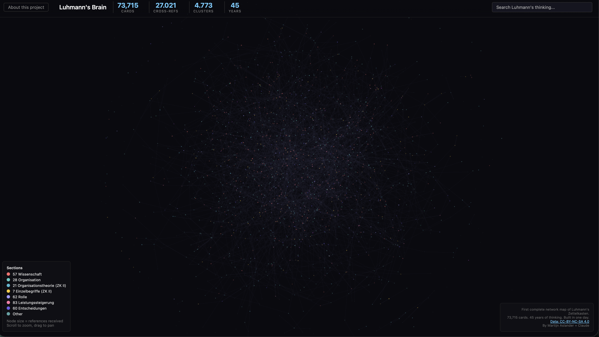

# Mapping Luhmann's Brain

**The first complete network map of Niklas Luhmann's 73,715-card Zettelkasten.**



Aria Khodaverdi, whom I met at the 3rd PKM Summit in the Netherlands, sent me a link to the Niklas Luhmann Archive — a €5 million, 15-year project to digitize 90,000 handwritten note cards. I looked at it and wondered: why does this have to take so long?

This is what happened in under two hours.

## Live demo

**[Explore the network](https://martijnaslander.github.io/luhmann-zettelkasten/)**

## What this is

Niklas Luhmann (1927–1998) built the most famous knowledge system in history: 90,000 handwritten note cards connected through tens of thousands of cross-references. Bielefeld University has been transcribing them since 2015. After 10 years, they're roughly one-third done.

In 70 years of Luhmann scholarship, nobody analysed the cross-references as a network graph. This project does that:

- **73,715 cards** downloaded via Bielefeld's open API
- **18,289 creative cross-references** (Fernverweise) mapped
- **504 bidirectional links** identified — where Luhmann talked back to his own system
- **43,222 cards** with searchable text (2.4 million words)
- **Interactive network visualization** with search, section filtering, and card detail panel

## Key findings

- The most-referenced card isn't about systems theory — it's about "Identifikation / Funktionalisierung"
- 7 of the top 10 hubs are in ZK I (1950s). His early thinking is the foundation, not the late work
- 18% of all cards (12,287) are completely isolated. Functionally dead
- Only 2.7% of cross-references are bidirectional. True dialogue is rare
- "Geheimhaltung" (secrecy) is the most-indexed keyword — a hidden obsession

Read all [50 findings](https://martijnaslander.github.io/luhmann-zettelkasten/blog/preliminary-findings.html).

## Blog posts

1. [50 Things Nobody Knew About Luhmann's Zettelkasten](https://martijnaslander.github.io/luhmann-zettelkasten/blog/preliminary-findings.html)
2. [What Happens When You Have All 90,000 Cards](https://martijnaslander.github.io/luhmann-zettelkasten/blog/what-happens-next.html)
3. [8 Lessons for Anyone Building a Knowledge System](https://martijnaslander.github.io/luhmann-zettelkasten/blog/lessons-for-knowledge-systems.html)
4. [The Ripple Method — How Context Reads Context](https://martijnaslander.github.io/luhmann-zettelkasten/blog/the-ripple-method.html)
5. [The Architecture Behind It — How ThetaOS Maps Onto Luhmann](https://martijnaslander.github.io/luhmann-zettelkasten/blog/thetaos-architecture.html)

## How it works

The download script makes 9 API calls to `v0.api.niklas-luhmann-archiv.de`:

```bash
API="https://v0.api.niklas-luhmann-archiv.de/ZK/search"

for zk_id in 1 2; do
    page=1
    while true; do
        q="{\"page\":${page},\"rows\":10000,\"zks\":[\"${zk_id}\"]}"
        curl -s -o "zk${zk_id}_p${page}.json" "${API}?q=$(python3 -c "import urllib.parse; print(urllib.parse.quote('$q'))")"
        count=$(python3 -c "import json; print(len(json.load(open('zk${zk_id}_p${page}.json')).get('results',[])))")
        [ "$count" -eq 0 ] && break
        page=$((page + 1))
        sleep 3
    done
done
```

That's it. Luhmann's life's work, in a curl loop.

## Project structure

```
├── docs/                    ← GitHub Pages website
│   ├── index.html           ← Landing page
│   ├── explorer/            ← Interactive network visualization
│   └── blog/                ← Blog posts
├── pipeline/                ← Download & analysis scripts
├── build_database.py        ← JSON → SQLite
├── analyze_network.py       ← Network analysis
├── download.sh              ← API download script
└── output/                  ← Network stats & visualization data
```

## Data source

All data from [Niklas Luhmann-Archiv](https://niklas-luhmann-archiv.de/), Universität Bielefeld, licensed under **CC-BY-NC-SA 4.0**.

## Note on method

I'm not a scientist. I'm a PKM researcher who wanted to see how far one person with AI could get in a single session. No recognized scientific methodology has been applied. The academic edition at Bielefeld is the scholarly standard — this project complements it with a structural perspective.

## Author

**Martijn Aslander** — independent thinker, builder of [ThetaOS](https://world.hey.com/martijnaslander/i-think-i-ve-built-a-mythical-machine-cac6597f), and PKM researcher.

Built with [Claude](https://claude.ai) (Anthropic) as AI collaborator.

[Website](https://martijnaslander.github.io/luhmann-zettelkasten/) · [LinkedIn](https://www.linkedin.com/in/martijnaslander/) · [Blog](https://world.hey.com/martijnaslander)
